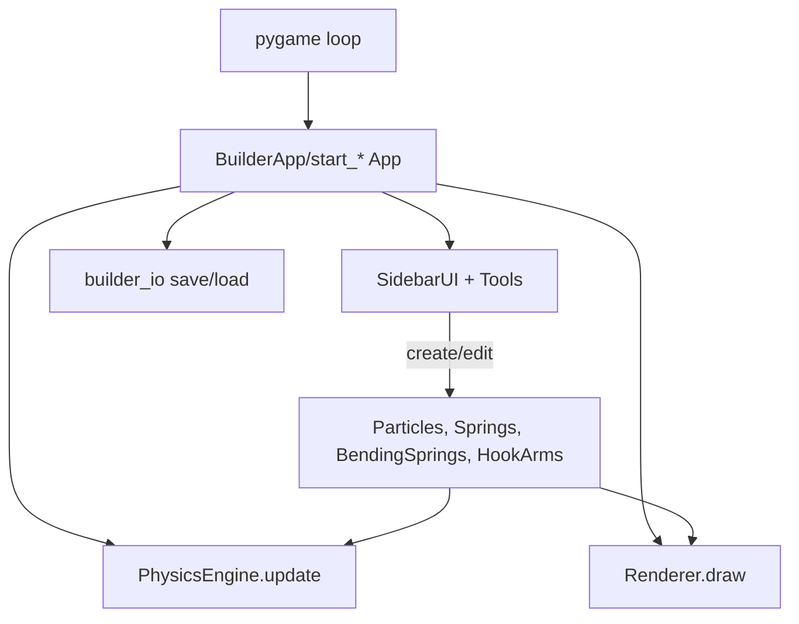

# Pylife: Agent Handbook

This document is the definitive guide for future agents working on this codebase. It explains the project’s purpose, architecture, module responsibilities, UI/UX flows, persistence format, extension points, coding standards, and maintenance expectations. Keep this file and `README.md` in sync with changes.

---

## What this project is

Pylife is a compact 2D soft‑body sandbox using pygame. It simulates point‑mass particles connected by linear and angular constraints and includes:

- An interactive builder (`start_create.py`) with a sidebar of tools to create/edit particles, springs, bending springs, rods, circles, and flexible hook arms; select multiple objects; adjust environment; save/load; undo; and use a grid for snapping.
- A set of demo scenes (`start_*.py`) showcasing common configurations.
- A small, readable physics/rendering core designed to be extended.

---

## Quick start for agents

- Ensure Python 3.10+ and `pygame` are installed. Optional: Tkinter for color/file pickers.
- Run the interactive builder:
  - `python start_create.py`
- Try the demos in parallel to verify invariants:
  - `python start.py`, `python start_basic.py`, `python start_rod.py`, `python start_bending_wall.py`, `python start_hook_arm.py`, `python start_four_rods.py`, `python start_gradient_wall.py`

---

## Architecture overview

### High‑level flow



### Module map

- Core simulation
  - `particle.py`: Verlet‑integrated point mass with per‑particle drag.
  - `spring.py`: Linear springs with Hooke’s law, optional break force, color coded by stretch/compression.
  - `bending_spring.py`: Angular constraint maintaining an angle p1–p2–p3.
  - `physics.py`: `PhysicsEngine` orchestrating gravity, springs, bends, short‑range repulsion, viscous drag scaled by per‑particle drag, Brownian noise, wall proximity friction, and integration. Collisions use a spatial hash with a separate configurable cell size.
  - `renderer.py`: World/screen transforms, camera zoom, drawing springs, bends (dashed), particles (with red outline for high‑drag).

- Structures and helpers
  - `structures.py`: Factories for walls, rods (capsules), and walls with bends.
  - `hook_arm.py`: `HookArm` helper (chain with extend/adhere/contract cycle, high‑drag tip state).

- Builder UI and persistence
  - `start_create.py`: `BuilderApp` main loop, camera, play area, history/undo, mode handlers, and integration of tools.
  - `builder_ui/`: Sidebar, fields (sliders, color picker, key selector, buttons), and tools (particle, spring, variable variants, bend, circle, rod, arm, grid, environment, inspect, delete shortcuts).
  - `builder_io.py`: JSON save/load helpers; `color_picker.py`, `file_dialog.py` use Tk in a subprocess.

- Demos
  - `start.py`, `start_basic.py`, `start_rod.py`, `start_bending_wall.py`, `start_hook_arm.py`, `start_four_rods.py`, `start_gradient_wall.py`.

---

## Core simulation details

### Particles

- Verlet integration with state: `pos`, `prev_pos`, `acc`, `mass`, `fixed`, `color`, `radius`, `tag`, `drag`, `elasticity`.
- High drag (drag > 1) simulates adhesion; rendered with a red outline.

### Springs

- Hooke’s law applied per frame, with optional `max_force` breakage and `invisible` flag.
- `get_color()` maps compression/extension to blue/white/red for visual feedback.

### Bending springs

- Maintain a rest angle at the middle particle; apply torque‑like corrective forces around the vertex.

### PhysicsEngine.update(dt)

- Applies: gravity; spring forces; bending forces; O(n^2) short‑range repulsion; radius‑based collision resolution with per-particle elasticity and optional restitution; viscous drag scaled by per‑particle `drag`; Brownian random force; Verlet integration; increased friction near boundaries based on either window size or a configured play area.

---

## Rendering and camera

- World/screen transforms live in `renderer.py` with `set_camera`, `world_to_screen`, `screen_to_world`.
- The builder zooms with mouse wheel when the cursor is over the world area, anchoring the zoom at the mouse position.
- Play area is rendered as a rectangle; simulation boundary clamping uses either the play area or the screen size.

---

## Interactive Builder (start_create.py)

### Modes and keybindings

- Number keys select tools (shown on buttons):
  - 1 Drag, 2 Particle, 3 Spring, 4 Bend, 5 Circle, 6 Rod, 7 Arm, 8 Inspect, 9 Grid, 0 Env
Other controls:
  - Ctrl+S Select tool
  - Ctrl+C copy selection of particles, springs, bends and hook arms
  - Ctrl+V paste selection
  - Space pause/resume
  - Backspace/Delete delete selection (particles, springs, bends, hook arms) or switch to Delete tool
  - Sidebar: Save, Load, Undo buttons; mouse‑wheel scroll within sidebar

### Tools (sidebar)

- Drag: Grab/release nearest particle.
- Select: Drag a rectangle to highlight particles, springs, bends and hook arms; Backspace/Delete removes the selection, Ctrl+C copies it and Ctrl+V pastes it.
- Particle / VarPar: Place new particles; variable particles can toggle to a second drag value under a key (hold/toggle modes).
- Spring / VarSpr: Connect nearest pairs; variable springs switch between base and alternate rest lengths under a key (hold/toggle modes).
- Bend: Select 3 particles; angle can be manual or auto from current geometry.
- Circle: Preview ring with segments, stiffness, optional bend springs (with separate stiffness).
- Rod: Preview capsule with segments; options for cytoskeleton, internal skeleton, and optional bend springs.
- Arm: Attach `HookArm` to a base particle; control segments, spacing, mass, radius, stiffness, cycle speed, colors, adhesion factor, cycle key.
- Inspect: Click an existing particle, spring, or bend to edit properties in place; convert between normal/variable spring/particle types; toggle spring visibility; set `max_force` (0 means unlimited/None).
- Grid: Toggle overlay and spacing; new placements snap to intersections. `snap_to_grid` leaves aligned coords unchanged.
- Env: Adjust gravity, repulsion radius/strength, damping, temperature, toggle collisions.

### Undo and deletion

- `Undo` reverts the most recent structural change. `remove_entities` removes particles, springs, bends, and arms safely and keeps key‑registrations in sync.

---

## Persistence (save/load)

Scenes are serialized to JSON via `builder_io.py`. Loading rebuilds objects and re‑registers key‑controlled elements.

### Schema (conceptual)

- `particles`: list of
  - `pos`, `prev`: [x, y]
  - `mass`, `radius`, `color` (RGB or null), `tag`, `fixed`, `drag`, `elasticity`
  - variable particle extras (when `type == "variable"`): `base`, `alt`, `speed`, `key`, `mode` ("hold"|"toggle"), `active`, `curr`
- `springs`: list of
  - `p1`, `p2` (indices into particles), `rest`, `stiff`, `max`, `invis`
  - variable spring extras (when `type == "variable"`): `alt`, `speed`, `key`, `mode`, `active`, `curr`
- `bending`: list of `{ p1, p2, p3, angle, stiff }`
- `arms`: list of
  - `particles` (indices), `springs` (indices into global springs), `rest_lengths`, `max_lengths`, `cycle_speed`, `color`, `high_color`, `adhesion` (mass factor), `orig_mass`, `adhesion_drag`, `orig_drag`, `cycle_key`
- `physics`: `{ gravity: [gx, gy], repulsion_radius, repulsion_strength, temperature, damping_coeff, collisions, collision_elasticity, collision_bucket_size }`

### Example

```json
{
  "particles": [
    {"pos": [100, 200], "prev": [100, 200], "mass": 1.0, "radius": 10, "color": [255, 0, 0], "tag": null, "fixed": false, "drag": 1.0, "elasticity": 1.0},
    {"pos": [160, 200], "prev": [160, 200], "mass": 1.0, "radius": 10, "color": [255, 0, 0], "tag": null, "fixed": false, "drag": 1.0, "elasticity": 1.0}
  ],
  "springs": [
    {"p1": 0, "p2": 1, "rest": 60.0, "stiff": 200.0, "max": null, "invis": false}
  ],
  "bending": [],
  "arms": [],
  "physics": {"gravity": [0, 0], "repulsion_radius": 30, "repulsion_strength": 1000, "temperature": 0, "damping_coeff": 1, "collisions": true, "collision_elasticity": 1.0, "collision_bucket_size": 0}
}
```

---

## Extending the system

### New forces/constraints

- Create a module implementing an object with an `apply()` method. Instantiate and add to app‑level collections; have `PhysicsEngine.update` call it each step (mirroring springs/bends).

### New shapes/structures

- Add a `create_*` function to `structures.py` returning `(particles, springs)` and optionally bends. Use inside a new or existing tool for previews.

### New sidebar tools

- Subclass `builder_ui.tools.base.Tool`.
- Render controls using `builder_ui/fields.py` components.
- Implement `draw_ui`, `draw_preview`, and `handle_event` using world coordinates for world interactions. Wire into `builder_ui/sidebar.py` and `BuilderApp.set_mode`.

### New variable elements or key‑driven behavior

- Follow `variable_spring.py` and `variable_particle.py` patterns. Ensure registration maps (`vspring_keys`, `vparticle_keys`, `cycle_keys`) are updated in create/convert/save/load paths.

---

## Coding standards for agents

- Keep code small, focused, and well‑named. Prefer dataclasses for shared configuration (see `builder_ui/config.py`).
- Type hints for public APIs; avoid `any`‑style typing.
- Clear docstrings on modules/classes/functions explaining intent.
- Control flow with early returns; avoid deep nesting.
- No inline commentary inside code; place comments above complex logic blocks.
- Match existing formatting; wrap long lines; don’t reformat unrelated code.

---

## Performance and stability

- Reduce particle count and spring density for heavier scenes.
- Tune stiffness and damping to avoid instability; consider `max_force` to prevent runaway springs.
- Repulsion is O(n^2); keep radius/particle count in check or disable where not needed.
- For sticky effects prefer raising `drag` over `fixed=True` during motion.

---

## Manual QA checklist (pre‑PR)

- Builder (`start_create.py`):
  - Place particle, spring, var‑particle, var‑spring, bend; create circle/rod; attach arm; use inspect to edit/convert; delete; undo works across all; grid snapping; env sliders; pause.
  - Save → Load roundtrip maintains: positions, prev positions, types, keys/modes, active flags, arm data, physics globals.
  - Zoom near sidebar vs world behaves as expected; sidebar scroll clamps to bounds.
- Demos: Run all `start_*.py` and verify documented keybindings.

---

## Maintenance expectations

- After any change, update both `README.md` and `AGENTS.md`.
- Add/update docstrings for new or modified modules/classes/functions.
- Keep defaults in `builder_ui/config.py` aligned with UI controls and serialization.
- When changing persistence fields, update both save and load paths and this document’s schema.
- Provide a CLI option for every new feature.

---

## Release note template

- Feature: <what changed> and why
- UI: new/changed tools, fields, keybindings
- Physics: new forces/behaviors; tuning/shaping changes
- Persistence: schema additions/changes (compat notes)
- Demos: updates/new scripts
- Dev notes: refactors, base classes, performance/stability fixes

---

## Pointers to read next

- `README.md` for end‑user overview and controls.
- `DOCS.md` for a narrative architecture and API quick reference.
- `start_create.py` for the builder application loop and integration points.
